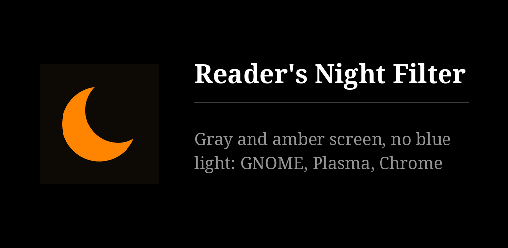

# Reader's Night Filter for the desktop and the browser

Turns the screen gray and amber, with no blue light, at the brightness you choose. The
desktop version covers the whole screen on GNOME (Xorg and Wayland sessions), on KDE
Plasma 6, on Windows 10 and 11 and on macOS 13 or newer; the browser version covers the
pages of Chrome and Brave on any system. A
companion of [Reader's Night Filter](https://github.com/funkypitt/readers-night) for
Android, which cannot remove blue entirely; these can.

The look is called Amber: colours are turned to gray, then tinted like a 1900 K light,
the coolest temperature that already has no blue (red whole, about half the green, no
blue), then dimmed to 70 %.

## Key points

- One switch: in the quick settings on GNOME, in the application menu on Plasma, in the
  notification area on Windows, in the menu bar on macOS, in the toolbar of the browser.
  Also a keyboard shortcut (Super+Shift+N on GNOME, Win+Shift+N on Windows, ⌃⌥⌘N on
  macOS, Alt+Shift+N in the browser) and the `readers-night` command on Linux.
- A notification says when the filter switches on or off, and when a part of it could
  not be applied. It can be turned off.
- Settings: gray or colours kept, brightness from 15 to 100 %.
- A schedule if you want one: `readers-night schedule 21:30 07:00`.
- Installed for one user, without administrator rights. On Linux `--uninstall` removes
  everything and puts Plasma's Night Light back as it was.
- No network access. Six languages.

## Install on a laptop

Download `readers-night-install.sh` from the [latest release](../../releases/latest), then,
in a terminal of the GNOME or Plasma session:

```sh
bash readers-night-install.sh
```

- **GNOME** (45 or newer): log out and back in once. The filter then comes on, and its
  switch is in the quick settings under the name Night Filter. `readers-night settings`
  opens its settings window.
- **Plasma 6**: the filter comes on at once. Its switch is Reader's Night Filter in the
  application menu; pin it to the panel. Settings go through the command.

```sh
readers-night on | off | toggle | status
readers-night brightness 60
readers-night gray off
readers-night notify off
readers-night schedule 21:30 07:00
readers-night schedule off
bash readers-night-install.sh --uninstall
```

## Install on Windows

Download `readers-night_<version>_windows.exe` from the [releases](../../releases), put it
where it will stay (Documents, for example) and open it. Windows warns that it does not know
the publisher: *More info* › *Run anyway*. The crescent appears in the notification area,
bottom right; Windows may hide it under the ^ arrow, from where it can be dragged next to
the clock.

- A click on the crescent switches the filter; a right click opens the settings
  (gray, brightness, notifications, schedule, start with Windows).
- It starts with Windows from the first opening; untick it in the menu to stop that.
- Opening the .exe again while it runs switches the filter, so a shortcut on the taskbar
  works as a switch too.
- To remove it: untick *Start with Windows*, *Quit*, delete the .exe and the folder
  `%APPDATA%\Readers Night Filter`.

Needs nothing installed: it uses the .NET Framework that comes with Windows 10 and 11.

## Install on macOS

Download `readers-night_<version>_macos.dmg` from the [releases](../../releases), open it
and drag the app into Applications. The first opening is refused because the app is not
notarised by Apple: open *System Settings* › *Privacy & Security*, click *Open Anyway* at
the bottom, and confirm. Allow its notifications when macOS asks.

- The crescent is in the menu bar, top right; its menu holds the switch and the settings.
- It opens at login from the first opening (*Open at login* in the menu).
- Apple Silicon and Intel, macOS 13 or newer.

## Install in Chrome or Brave

Download `readers-night-browser-<version>.zip` from the [latest release](../../releases/latest),
unzip it, open `chrome://extensions` (or
`brave://extensions`), switch on Developer mode, choose Load unpacked and pick the
folder. Click the crescent in the toolbar for the switch and the brightness.

## Limits

- **GNOME**: the mouse pointer keeps its own colours. Screenshots and screen recordings
  made while the filter is on come out amber.
- **Plasma**: the amber is Plasma's own Night Light, held at a constant 1900 K while the
  filter is on; your Night Light settings are saved and put back when it goes off, but a
  change you make to them in between is lost. The gray and the dimming are applied to
  windows, so the Overview and similar full-screen views show their thumbnails in
  colour (still without blue). Screenshots come out gray, not amber.
- **Windows**: the effect is the one Windows' own colour filters and the Magnifier use;
  while either is on, they and the night filter take turns. Screenshots keep their
  colours. HDR displays not tried.
- **macOS**: the amber and the dimming are the screen's colour tables, the gray is the
  system's own grayscale (Accessibility › Display › Color Filters), switched by a function
  Apple does not document: if a macOS update removes it, the app says so and the gray can
  be turned on in System Settings by hand. If you already use that grayscale, the app
  leaves it on when the filter goes off. Screenshots keep their colours.
- **Browser**: the browser's own pages (settings, extension store) and its tab bar
  cannot be filtered. The dimming darkens the page, not the backlight.
- The brightness setting darkens the picture; the backlight stays where the keyboard's
  brightness keys put it.

More detail: [docs/NOTES.md](docs/NOTES.md).

## Build and test

```sh
tools/build-installer.sh        # dist/readers-night-install.sh and the browser zip
python3 tests/browser_test.py   # needs Playwright with its Chromium
```

Windows and macOS build on GitHub Actions (`.github/workflows/windows-macos.yml`), which
also runs each app's `--self-test`: it sets the colours, reads them back from the system,
and checks the gray and the schedule. The Windows app alone builds anywhere with
`dotnet build windows/ReadersNight.csproj`; the Mac app with `macos/build.sh` on a Mac.

The Linux desktop tests run GNOME Shell and KWin in containers, install with the real
installer and compare pictures of the screen pixel by pixel:

```sh
docker build --build-arg RELEASE=24.04 -t rn-ubuntu:24.04 -f tests/docker/ubuntu.Dockerfile tests/docker
docker build -t rn-manjaro -f tests/docker/manjaro.Dockerfile tests/docker
docker run --rm -e RN_SESSION=x11 -v "$PWD":/src:ro -v "$PWD/tests/out":/out rn-ubuntu:24.04 bash /src/tests/gnome_test.sh
docker run --rm -e RN_SESSION=wayland -v "$PWD":/src:ro -v "$PWD/tests/out":/out rn-ubuntu:24.04 bash /src/tests/gnome_test.sh
docker run --rm --cap-add SYS_NICE --device /dev/dri/renderD128 -v "$PWD":/src:ro -v "$PWD/tests/out":/out rn-manjaro bash /src/tests/plasma_test.sh
```

## Crédits / Credits

© 2026 Pierre Gallaz. Développé avec [Claude Code](https://claude.com/claude-code) (Anthropic).
Licence MIT, voir `LICENSE`.

© 2026 Pierre Gallaz. Developed with [Claude Code](https://claude.com/claude-code) (Anthropic).
MIT licence, see `LICENSE`.
